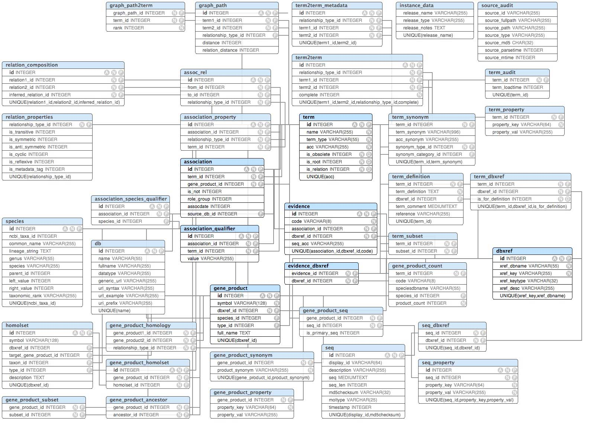

# Database Homework

## Yeast Apoptosis Genes [20 pt]

- Download [sacan.biomed.drexel.edu/ftp/binf/godb.sqlite](https://sacan.biomed.drexel.edu/ftp/binf/godb.sqlite)
- Write a GO query to find the names of yeast genes that are associated with 
  "execution phase of apoptosis". Here, we define "yeast" as any organism under 
  the genus "Saccharomyces".
- Fetch the results of your GO query from the web and display them as output 
  from your python/MATLAB code.
- The GO database ER (Entity-Relationship) diagram is shown below:
  
  

## mirdb [80 pt]

- **[30 pt]** Create a database from [mirdb data](https://mirdb.org/download.html)
  - Any downloaded files should be stored elsewhere on your computer (i.e., in
    a 'temporary' directory)
  - Store the database elsewhere (in a 'temporary' directory) on your computer; 
    not within the same folder as your assignmnet.

- **[20 pt]** How many miRNAs are predicted to target XM_532324 ?
  - Show at most 10 miRNAs that are predicted to target XM_532324 .
  
- **[20 pt]** How many predicted targets of cfa-let-7a have a prediction score 
  of at least 80?
  - Show at most 10 predicted targets of cfa-let-7a that have a prediction 
    score of at least 80.

- **[10 pt]** List the miRNAs and the number of their targets. (Each row of the 
  result should contain a distinct miRNA). (Use count() and GROUP BY). Show 
  only top 10 rows of the result.

## Perfomance Comparison - Excel vs. Database

In this section, you  are asked to compare the performance of adding & 
retrieving data from a database table vs an Excel spreadsheet.

Create an external file `'xls_insertname.m'` for the function 
`xls_insertname(xlsfile, name)` that:

- Creates the Excel file `'xlsfile'` ` if it does not exist and writes the 
  header row containing `"id"` and `"name"`  (without the quotes) as the
  column names.
- Adds the name to the Excel file as a new row, along with its `id`. You need 
  to automatically determine a unique integer id for this new name being added
  (similar to SQL's auto-increment feature).
- Returns the total number of names in the table (not including the header row,
  but including the new row that you just added).

Create an external file `'db_insertname.m'` for the function `'db_insertname(dbfile, name)'` that:

- Creates the database table `"names"` if the table does not already exist. 
  The table needs to have the columns "id" and "name" (without the quotes).
- Adds the name to the names table as a new row. You should not identify the id 
  of this new row yourself, but need to have the database automatically 
  identify the id.
- You may assume that the name will be at most 16 characters long.
- Returns the total number of names in the table (not including the header row,
  but including the new row that you just added).

Run & time multiple inserts

- Identify how long it takes to make 1000 inserts of random 16-character names 
  using `xls_insertname()`. Report the total elapsed time.
- Identify how long it takes to make 1000 inserts of random 16-character names 
  using `db_insertname()`. Report the total elapsed time.
